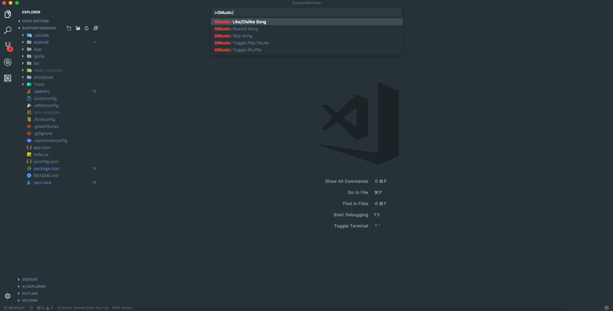

# vscode-gmusic

> [!NOTE]
> This project has been archived with the closing of Google Play Music. For those now on YouTube Music, I recommend [`sedders123/vscode-ytmusic`](https://github.com/sedders123/vscode-ytmusic).

Connecting VS Code with the [Unofficial Google Play Music Desktop Player](https://googleplaymusicdesktopplayer.com/)

## Features

* See what song is currently playing
* Play / Pause
* Thumbs Up / Down
* Skip / Rewind
* Toggle Shuffle

## Requirements

* [Unofficial Google Play Music Desktop Player](https://googleplaymusicdesktopplayer.com/)
* **Make sure the Playback API is enabled in Desktop Settings! vscode-gmusic will not work without it!**

